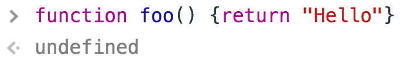

# Functions

<p class="sub-title">함수</p>

함수는 한 번 정의하면 몇 번이든 실행할 수 있고 호출할 수 있는 코드 블록이다.


코드의 목적을 좀 더 알기 쉽게 하고 필요할 때 마다 재 사용할 수 있다.
프로그램의 동작을 작은 조각들로 분리하고 그 조각들이 명료하게 한 가지 일만 하게끔 한다.
유지 관리하는 것이 쉬워진다.

자바스크립트의 함수는 일급 객체로 코드 재용, 정보의 구성 및 은닉 등에 사용하는 모듈화의 근간이다.


## 함수 정의하기

> _**함수를 정의하는 방법**_
> * 함수 선언문 (Function Declarations)
> * 함수 표현식 (Function Expressions)
> * Function() 생성자 함수

함수 선언문과 함수 표현식은 `function` 키워드로 정의되며, 다음의 구성 요소들이 있다.

<dl>
    <dt><u>함수명</u></dt>
    <dd>함수를 구분하는 식별자 <sup>Identifier</sup>이다.<br>함수 표현식에서는 생략 가능하다.</dd>
    <dt><u>매개변수 목록</u></dt>
    <dd>0개 이상의 목록으로 쉼표`,`로 구분하며 괄호`()`로 묶는다. 자바스크립트는 매개변수의 데이터 타입을 명시하지 않으므로 함수 몸체 내에서 데이터 타입 체크가 필요할 수 있다.</dd>
    <dt><u>함수 몸체</u></dt>
    <dd>함수가 호출되었을 때 실행되는 0개 이상의 구문들의 집합이며 중괄호`{}`로 묶는다.</dd>
</dl>

### 함수 선언문

<pre class="syntax">
function 함수명() {
    // 자바스크립트 코드
}
</pre>

Function Statement라고도 하며 말 그대로 함수의 정의를 나타내는 '문'이다. Statement의 개념을 알고 있다면 이 함수 선언문의 코드 블록 자체는 실행 가능 코드가 아니라서 어떠한 결과도 `return` 되지 않는다는 것을 예상할 수 있다. (이러한 이유로 함수 선언문을 Class와 동일한 개념으로 이해해도 무방하다.)  

그러므로 아래의 함수 선언문을 실행시키면 `undefined`값을 반환한다.

```js
function foo() {
    return "Hello"
}
foo();
```

 


### 함수 표현식

<pre class="syntax">
var 함수명 = function() {
    // 자바스크립트 코드
}
</pre>

```js
var foo = function() {
    return "Hello"
}
foo();
```


http://insanehong.kr/post/javascript-function/

http://meetup.toast.com/posts/118

